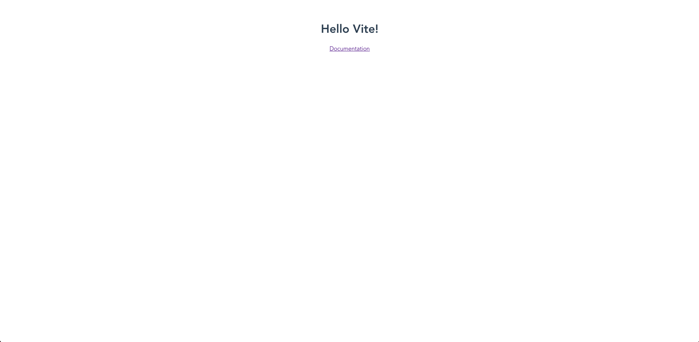
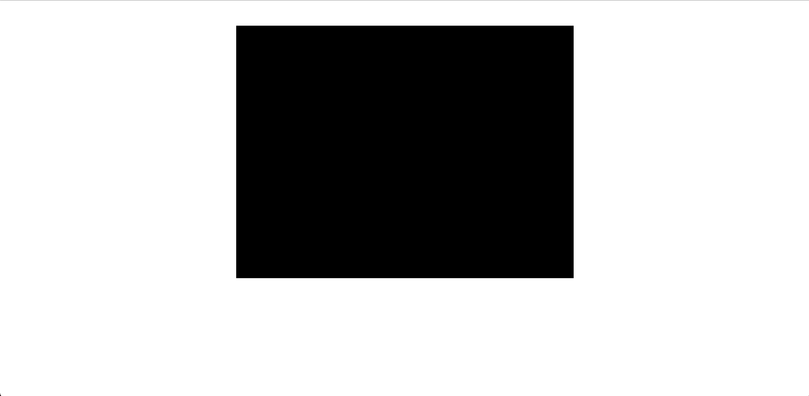
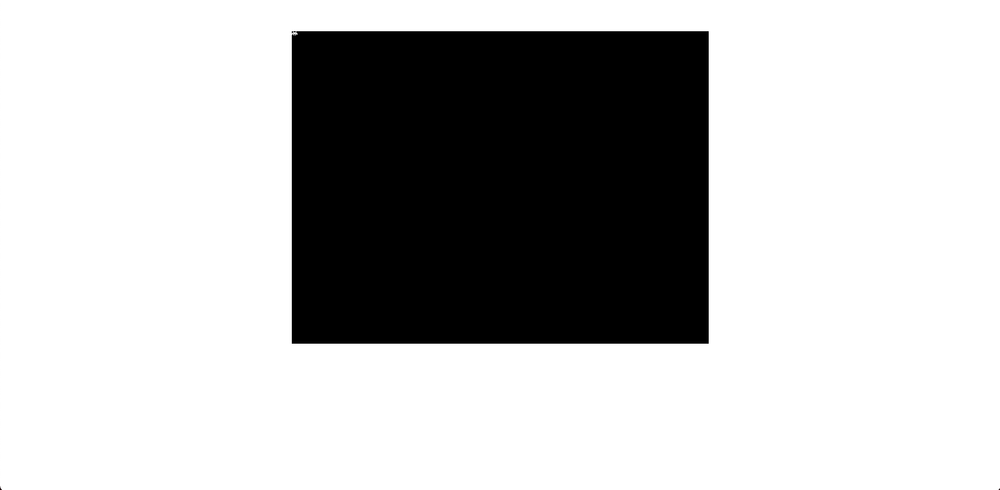
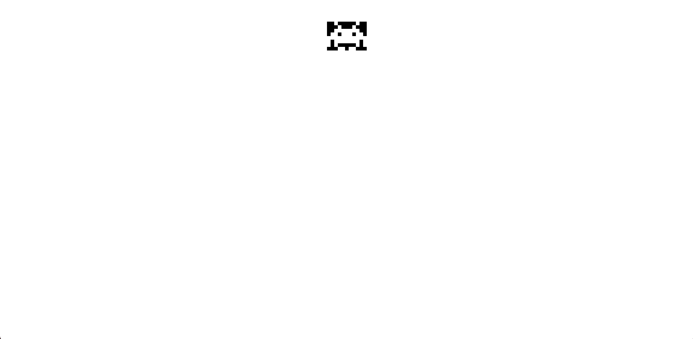
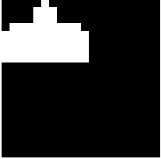
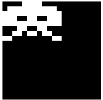
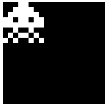

# Day1

## Setup 前置準備

工欲善其事，必先利其器。
此節會先準備現代開發中不可或缺的一些工具，

### Environment 環境

- [NodeJS](https://nodejs.org/en/)
- [Yarn](https://classic.yarnpkg.com/en/)

### Bundle System 打包工具

我將會使用 [Vite](https://vitejs.dev/), 作為打包工具喔。

- 首先 建立新的專案 

```bash
yarn create @vitejs/app space-invaders --template vanilla-ts
```

- 進入那個專案，並開啟 Dev Server

```bash
cd space-invaders
yarn && yarn dev
```

- 打開瀏覽器 `localhost:3000`，此時畫面應為




- 打開你的 Editor，開始出發拉!

## Application 

首先要先在頁面上生成 `<canvas />` 以方便我們繪圖，
我們將採用 `pixi.js` 作為繪圖引擎，

```bash
yarn add pixi.js
```

**note. 請注意卡比此時的版本為 `"pixi.js": "^6.0.4"`**

接著在 `main.ts` 導入，

```ts
import { Application } from "pixi.js";
```

接著我們將底下預設的程式碼換成

```ts
const app = new Application();

document.querySelector("#app")?.append(app.view);
```

此時畫面應該如下，



程式碼如下，

-- `src/main.ts`

```ts
import { Application } from "pixi.js";

const app = new Application();

document.querySelector("#app")?.append(app.view);
```

## Pixel Art Assets 點陣圖資源

### 分析

那個年代並沒有繪圖軟體，圖片都是由工程師透過程式繪成，
所以我們首先要思考如何用程式繪製點陣圖形。

我們試著畫出，這個遊戲的代表外星人 `Crab`。


可以簡單看出 `Crab` 由高度 8 pixels 跟寬度 11 pixels 的點陣圖構成，且只有一個顏色。

像這樣的圖形可以透過 `2維陣列` 來記錄整張圖片點陣資料，
簡單的方式來記錄每個格子裡面有沒有顏色即可，
例如 1 - 有顏色， 0 - 沒有顏色。


故可以用以下表示這張圖片，

```typescript
const image = [
  [0, 0, 1, 0, 0, 0, 0, 0, 1, 0, 0],
  [0, 0, 0, 1, 0, 0, 0, 1, 0, 0, 0],
  [0, 0, 1, 1, 1, 1, 1, 1, 1, 0, 0],
  [0, 1, 1, 0, 1, 1, 1, 0, 1, 1, 0],
  [1, 1, 1, 1, 1, 1, 1, 1, 1, 1, 1],
  [1, 0, 1, 1, 1, 1, 1, 1, 1, 0, 1],
  [1, 0, 1, 0, 0, 0, 0, 0, 1, 0, 1],
  [0, 0, 0, 1, 1, 0, 1, 1, 0, 0, 0],
];
```

然後試著用上面的資料繪製點陣圖。

### 實作

接者我們要用 `pixi.js` 中的 `Graphics` API 進行點陣圖繪製，

```diff
- import { Application } from "pixi.js";
+ import { Application, Graphics } from "pixi.js";
```

生成物件
```ts
const graphics = new Graphics();
```

遍歷 `image` 陣列，透過資料來繪製圖形，

`if (image[y][x] === 0) continue;` 0 的話就不畫顏色，直接跳過。

`beginFill(0xffffff)` 是指先選好要上的顏色，`0xffffff` 就是白色的16進位色碼。

`drawRect(x, y, w, h)` 是指在某個位置畫一個特定寬高的矩形。

`endFill()` 畫完形狀並塗上顏色。

```ts
for (let y = 0; y < image.length; y++) {
  for (let x = 0; x < image[y].length; x++) {
    if (image[y][x] === 0) continue;

    graphics.beginFill(0xffffff);

    graphics.drawRect(x, y, 1, 1);

    graphics.endFill();
  }
}
```

最後將這個圖形放到畫面上即可

```ts
app.stage.addChild(graphics);
```

此時畫面應該如下



似乎有點小，將畫面的比例調整一下，
寬度 11 px, 高度 8 px, 放大 10 倍 來看看

```diff
- const app = new Application();
+ const app = new Application({
+   width: 11,
+   height: 8,
+   resolution: 10,
+ });
```

就這樣我們畫出 `Crab` 了。



程式碼如下，

-- `src/main.ts`

```ts
import { Application, Graphics } from "pixi.js";

const app = new Application({
  width: 11,
  height: 8,
  resolution: 10, 
});

document.querySelector("#app")?.append(app.view);

const graphics = new Graphics();

for (let y = 0; y < image.length; y++) {
  for (let x = 0; x < image[y].length; x++) {
    if (image[y][x] === 0) continue;

    graphics.beginFill(0xffffff);

    graphics.drawRect(x, y, 1, 1);

    graphics.endFill();
  }
}

app.stage.addChild(graphics);
```

## Refactor 重構

接下來我們要將這段`Crab`的程式碼整理到一個地方放，
方便以後我要再畫出`Crab`時可以直接使用，而不需要重新走過上面的思考流程。

首先，我們先建立一個 `characters` 的資料夾，並建立一隻新的檔案叫 `Crab.ts`。
並把畫出 `Crab` 的相關程式碼搬到那個地方。

-- `characters/Crab.ts`

```ts
import { Graphics } from "pixi.js";

const image = [
  [0, 0, 1, 0, 0, 0, 0, 0, 1, 0, 0],
  [0, 0, 0, 1, 0, 0, 0, 1, 0, 0, 0],
  [0, 0, 1, 1, 1, 1, 1, 1, 1, 0, 0],
  [0, 1, 1, 0, 1, 1, 1, 0, 1, 1, 0],
  [1, 1, 1, 1, 1, 1, 1, 1, 1, 1, 1],
  [1, 0, 1, 1, 1, 1, 1, 1, 1, 0, 1],
  [1, 0, 1, 0, 0, 0, 0, 0, 1, 0, 1],
  [0, 0, 0, 1, 1, 0, 1, 1, 0, 0, 0],
];

export default function Crab() {
  const graphics = new Graphics();

  for (let y = 0; y < image.length; y++) {
    for (let x = 0; x < image[y].length; x++) {
      if (image[y][x] === 0) continue;

      graphics.beginFill(0xffffff);

      graphics.drawRect(x, y, 1, 1);

      graphics.endFill();
    }
  }

  return graphics;
}
```

之後我們來測試一下 `Crab` 函式。

-- `main.ts`

```ts
import "./style.css";
import { Application } from "pixi.js";
import Crab from "./characters/Crab";

const app = new Application({
  width: 11,
  height: 8,
  resolution: 10,
});

document.querySelector("#app")?.append(app.view);

app.stage.addChild(Crab());
```

這樣我們就成功重構了`Crab`。

## Other Characters 其他角色

因為接下來的角色作法跟上面的 `Crab` 差不多，
我將直接提供其他角色的資料以供大家做練習。

### LaserCannon

```ts
const laserCannon = [
  [0, 0, 0, 0, 0, 1, 0, 0, 0, 0, 0],
  [0, 0, 0, 0, 1, 1, 1, 0, 0, 0, 0],
  [0, 0, 0, 0, 1, 1, 1, 0, 0, 0, 0],
  [0, 1, 1, 1, 1, 1, 1, 1, 1, 1, 0],
  [1, 1, 1, 1, 1, 1, 1, 1, 1, 1, 1],
  [1, 1, 1, 1, 1, 1, 1, 1, 1, 1, 1],
  [1, 1, 1, 1, 1, 1, 1, 1, 1, 1, 1],
  [1, 1, 1, 1, 1, 1, 1, 1, 1, 1, 1],
];
```



### Octopus

```ts
const octopus = [
  [0, 0, 0, 0, 1, 1, 1, 1, 0, 0, 0, 0],
  [0, 1, 1, 1, 1, 1, 1, 1, 1, 1, 1, 0],
  [1, 1, 1, 1, 1, 1, 1, 1, 1, 1, 1, 1],
  [1, 1, 1, 0, 0, 1, 1, 0, 0, 1, 1, 1],
  [1, 1, 1, 1, 1, 1, 1, 1, 1, 1, 1, 1],
  [0, 0, 0, 1, 1, 0, 0, 1, 1, 0, 0, 0],
  [0, 0, 1, 1, 0, 1, 1, 0, 1, 1, 0, 0],
  [1, 1, 0, 0, 0, 0, 0, 0, 0, 0, 1, 1],
];
```



### Squid

```ts
const squid = [
  [0, 0, 0, 1, 1, 0, 0, 0],
  [0, 0, 1, 1, 1, 1, 0, 0],
  [0, 1, 1, 1, 1, 1, 1, 0],
  [1, 1, 0, 1, 1, 0, 1, 1],
  [1, 1, 1, 1, 1, 1, 1, 1],
  [0, 0, 1, 0, 0, 1, 0, 0],
  [0, 1, 0, 1, 1, 0, 1, 0],
  [1, 0, 1, 0, 0, 1, 0, 1],
];
```

