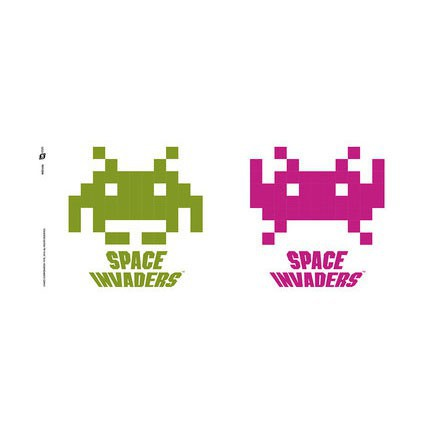
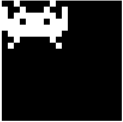
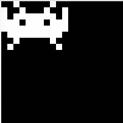

# Day2

## Animation 動畫

動畫在遊戲中扮演非常重要的角色，
當繪製的角色在螢幕上動起來時，就像是角色活起來一樣。
卡比接下來想要跟大家分享這份喜悅！

## 分析



`Crab` 在遊戲裏面在每次移動時都會把手舉起來，感覺像在跟玩家打招呼呢！
所以我們需要再畫一張把手舉起來的圖，並透過切換兩張圖達到打招呼的效果。

這類透過切換圖還達成效果的動畫稱作 [定格動畫 (Frame Animation)](https://en.wikipedia.org/wiki/Animation)，
在很多領域都會應用的到喔！

## 畫圖

首先我們要畫 `Crab` 舉手的圖形

-- `src/characters/Crab.ts`

```ts
const image2 = [
  [0, 0, 1, 0, 0, 0, 0, 0, 1, 0, 0],
  [1, 0, 0, 1, 0, 0, 0, 1, 0, 0, 1],
  [1, 0, 1, 1, 1, 1, 1, 1, 1, 0, 1],
  [1, 1, 1, 0, 1, 1, 1, 0, 1, 1, 1],
  [1, 1, 1, 1, 1, 1, 1, 1, 1, 1, 1],
  [0, 1, 1, 1, 1, 1, 1, 1, 1, 1, 0],
  [0, 0, 1, 0, 0, 0, 0, 0, 1, 0, 0],
  [0, 1, 0, 0, 0, 0, 0, 0, 0, 1, 0],
];
```

稍微改一下我們的 `Crab` 函式，

```diff
export default function Crab() {
  const graphics = new Graphics();

+  const image = image2;

  for (let y = 0; y < image.length; y++) {
    for (let x = 0; x < image[y].length; x++) {
      if (image[y][x] === 0) continue;

      graphics.beginFill(0xffffff);

      graphics.drawRect(x, y, 1, 1);

      graphics.endFill();
    }
  }

  return graphics;
}
```

這時畫面上應該長這樣



## 換圖

當然，程式執行時，我們不可能透過手動更改程式碼下去做更換圖片，
所以我們需要先撰寫好 *什麼時機點要做什麼事* ，像這樣的程式流程。

卡比接下來要示範，更換圖形的方式。

**以下方式只是眾多換圖方式的其中一種，大家可以嘗試出不同的方式**

### 認識 RequestAnimationFrame 與 Ticker

現代動畫大部分都是以一秒刷新60個畫面的方式來播放，瀏覽器也是。

而卡比想在每次畫面刷新前都去執行某段程式碼，
這個在做動畫中非常重要的函式，叫做 [requestAnimationFrame](https://developer.mozilla.org/en-US/docs/Web/API/window/requestAnimationFrame)。
透過這個函式，我們可以在畫面更新之前執行某些運算，
來改變每次畫面刷新的結果。

但是 `requestAnimationFrame` 是比較底層的 API，
實務上可能會需要更多的功能跟資料，例如. 距離上次刷新過了多久、能不能暫停 ...etc

而卡比接下來會使用的是 `pixi.js` 裏面的 [Ticker](http://pixijs.download/release/docs/PIXI.Ticker.html)。
他已經幫我們準備好了一些常用的功能。

### 實作

`pixi.js` 的 `Application` 預設會給一個 `Ticker`，
所以我們只需要把 `src/main.ts` 加工一下，

-- `src/main.ts`

```diff
const app = new Application({
  width: 20,
  height: 20,
  resolution: 10,
});

document.querySelector("#app")?.append(app.view);

app.stage.addChild(Crab());

+ app.ticker.add(() => {

+ });
```

你可以試試看在剛剛加入的 `arrow function` 裏面執行 `console.log`，
體驗一秒執行60次的感覺。

### 重構

接下來卡比要在每次刷新時，
重新繪製一個 `Crab` 並重新新增到畫面上。

-- `src/characters/Crab.ts`

```ts
export default function Crab() {
  return () => {
    const graphics = new Graphics();

    const image = image2;

    for (let y = 0; y < image.length; y++) {
      for (let x = 0; x < image[y].length; x++) {
        if (image[y][x] === 0) continue;

        graphics.beginFill(0xffffff);

        graphics.drawRect(x, y, 1, 1);

        graphics.endFill();
      }
    }

    return graphics;
  };
}
```

上面的寫法叫做 `Higher Order Function`，
就是 `函式` 可以回傳出另一個 `函式`。

然後在 `src/main.ts` 做出以下更動，

```diff
const app = new Application({
  width: 20,
  height: 20,
  resolution: 10,
});

document.querySelector("#app")?.append(app.view);

- app.stage.addChild(Crab());
+ const update = Crab();

app.ticker.add(() => {
+  app.stage.removeChildren();

+  app.stage.addChild(update());
});
```

這樣就可以在每次畫面刷新前，將畫面重置，重新運算產生結果。

然後，回到 `src/characters/Crab.ts`

-- `src/characters/Crab.ts`

```ts
export default function Crab() {
  let current = 0;
  const images = [image, image2];

  return () => {
    const image = images[current % images.length];
    current += 1;

    const graphics = new Graphics();

    for (let y = 0; y < image.length; y++) {
      for (let x = 0; x < image[y].length; x++) {
        if (image[y][x] === 0) continue;

        graphics.beginFill(0xffffff);

        graphics.drawRect(x, y, 1, 1);

        graphics.endFill();
      }
    }

    return graphics;
  };
}
```

這樣畫面上的 `Crab` 就會揮手了！但是...
好像揮的太快了，手會不會斷掉。

### Throttle

因為現在每一次畫面刷新都會執行運算，
實際上我們只需要一段時間執行一次而已，而其他的時間不執行運算，
`Throttle` 這個時候就派上用場了。

首先，我們需要獲得 `距離上次刷新過了多少時間` 後面簡稱 `Delta Time`。

-- `src/main.ts`

```diff
app.ticker.add(() => {
  app.stage.removeChildren();

- app.stage.addChild(update());
+ app.stage.addChild(update(app.ticker.deltaMS));
});
```

透過 `app.ticker.deltaMS` 我們獲得了 `Delta Time`，
將它拋進 `update` 函式後，

-- `src/characters/Crab.ts`

```diff
export default function Crab() {
  let current = 0;
  const images = [image, image2];

+ let timePass = 0;

- return () => {
+ return (delta: number) => {
+   timePass += delta;

    const image = images[current % images.length];
-   current += 1;
+   if (timePass > 1000) {
+      current += 1;
+      timePass = 0;
+   }

    const graphics = new Graphics();

    for (let y = 0; y < image.length; y++) {
      for (let x = 0; x < image[y].length; x++) {
        if (image[y][x] === 0) continue;

        graphics.beginFill(0xffffff);

        graphics.drawRect(x, y, 1, 1);

        graphics.endFill();
      }
    }

    return graphics;
  };
}
```

這樣就只會每 1 秒 切換一次圖片了！

最後結果如下：



## Other 

以下提供其他角色的圖片，大家可以自行實作看看！

### Crab

```ts
const image1 = [
  [0, 0, 1, 0, 0, 0, 0, 0, 1, 0, 0],
  [0, 0, 0, 1, 0, 0, 0, 1, 0, 0, 0],
  [0, 0, 1, 1, 1, 1, 1, 1, 1, 0, 0],
  [0, 1, 1, 0, 1, 1, 1, 0, 1, 1, 0],
  [1, 1, 1, 1, 1, 1, 1, 1, 1, 1, 1],
  [1, 0, 1, 1, 1, 1, 1, 1, 1, 0, 1],
  [1, 0, 1, 0, 0, 0, 0, 0, 1, 0, 1],
  [0, 0, 0, 1, 1, 0, 1, 1, 0, 0, 0],
];

const image2 = [
  [0, 0, 1, 0, 0, 0, 0, 0, 1, 0, 0],
  [1, 0, 0, 1, 0, 0, 0, 1, 0, 0, 1],
  [1, 0, 1, 1, 1, 1, 1, 1, 1, 0, 1],
  [1, 1, 1, 0, 1, 1, 1, 0, 1, 1, 1],
  [1, 1, 1, 1, 1, 1, 1, 1, 1, 1, 1],
  [0, 1, 1, 1, 1, 1, 1, 1, 1, 1, 0],
  [0, 0, 1, 0, 0, 0, 0, 0, 1, 0, 0],
  [0, 1, 0, 0, 0, 0, 0, 0, 0, 1, 0],
];
```

### Octopus

```ts
const image1 = [
  [0, 0, 0, 0, 1, 1, 1, 1, 0, 0, 0, 0],
  [0, 1, 1, 1, 1, 1, 1, 1, 1, 1, 1, 0],
  [1, 1, 1, 1, 1, 1, 1, 1, 1, 1, 1, 1],
  [1, 1, 1, 0, 0, 1, 1, 0, 0, 1, 1, 1],
  [1, 1, 1, 1, 1, 1, 1, 1, 1, 1, 1, 1],
  [0, 0, 0, 1, 1, 0, 0, 1, 1, 0, 0, 0],
  [0, 0, 1, 1, 0, 1, 1, 0, 1, 1, 0, 0],
  [1, 1, 0, 0, 0, 0, 0, 0, 0, 0, 1, 1],
];

const image2 = [
  [0, 0, 0, 0, 1, 1, 1, 1, 0, 0, 0, 0],
  [0, 1, 1, 1, 1, 1, 1, 1, 1, 1, 1, 0],
  [1, 1, 1, 1, 1, 1, 1, 1, 1, 1, 1, 1],
  [1, 1, 1, 0, 0, 1, 1, 0, 0, 1, 1, 1],
  [1, 1, 1, 1, 1, 1, 1, 1, 1, 1, 1, 1],
  [0, 0, 1, 1, 1, 0, 0, 1, 1, 1, 0, 0],
  [0, 1, 1, 0, 0, 1, 1, 0, 0, 1, 1, 0],
  [0, 0, 1, 1, 0, 0, 0, 0, 1, 1, 0, 0],
];
```

### Squid

```ts
const image1 = [
  [0, 0, 0, 1, 1, 0, 0, 0],
  [0, 0, 1, 1, 1, 1, 0, 0],
  [0, 1, 1, 1, 1, 1, 1, 0],
  [1, 1, 0, 1, 1, 0, 1, 1],
  [1, 1, 1, 1, 1, 1, 1, 1],
  [0, 0, 1, 0, 0, 1, 0, 0],
  [0, 1, 0, 1, 1, 0, 1, 0],
  [1, 0, 1, 0, 0, 1, 0, 1],
];

const image2 = [
  [0, 0, 0, 1, 1, 0, 0, 0],
  [0, 0, 1, 1, 1, 1, 0, 0],
  [0, 1, 1, 1, 1, 1, 1, 0],
  [1, 1, 0, 1, 1, 0, 1, 1],
  [1, 1, 1, 1, 1, 1, 1, 1],
  [0, 1, 0, 1, 1, 0, 1, 0],
  [1, 0, 0, 0, 0, 0, 0, 1],
  [0, 1, 0, 0, 0, 0, 1, 0],
];
```
